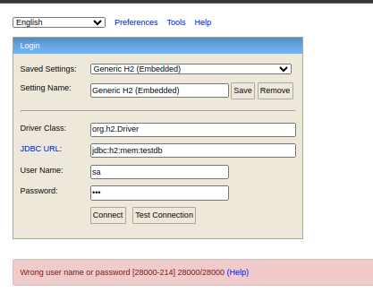

# TIVIA API

### Caso queria rodar o banco localmente containerizado

- Passo 1: Baixar a imagem do PostgreSQL:
    O primeiro passo é baixar a imagem do PostgreSQL do Docker Hub. Execute o seguinte comando em seu terminal:
`docker pull postgres:14.2`

- Passo 2: Executar o contêiner do PostgreSQL :
  Após ter a imagem do PostgreSQL baixada, você pode executar um contêiner a partir dela. Use o seguinte comando:
    `docker run -itd -e POSTGRES_USER=postgres -e POSTGRES_PASSWORD=postgres123 -p 5432:5432 -v /var/lib/postgresql/data:/data --name postgresql postgres:14.2`

- Iniciar o container: 
  `docker start postgresql`

### Acesso ao Console H2
- Com essas configurações, você pode acessar o console do H2 navegando
para `http://localhost:8080/api/h2-console` em seu navegador. Use as configurações de conexão definidas (jdbc:h2:mem:testdb) 
 para se conectar ao banco de dados.

    http://localhost:8080/api/h2-console
    jdbc url: jdbc:h2:mem:testdb
    user name: sa
    password: 123

