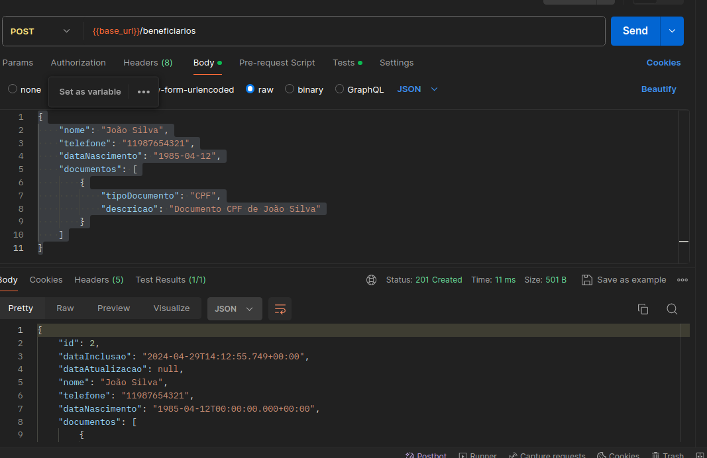

# TIVIA API  (Gestão de Beneficiários e Documentos)

### Caso queria rodar o banco localmente containerizado

- Passo 1: Baixar a imagem do PostgreSQL:
    O primeiro passo é baixar a imagem do PostgreSQL do Docker Hub. Execute o seguinte comando em seu terminal:
`docker pull postgres:14.2`

- Passo 2: Executar o contêiner do PostgreSQL :
  Após ter a imagem do PostgreSQL baixada, você pode executar um contêiner a partir dela. Use o seguinte comando:
    `docker run -itd -e POSTGRES_USER=postgres -e POSTGRES_PASSWORD=postgres123 -p 5432:5432 -v /var/lib/postgresql/data:/data --name postgresql postgres:14.2`

- Iniciar o container: 
  `docker start postgresql`


### Acesso ao Console H2
- Com essas configurações, você pode acessar o console do H2 navegando
para `http://localhost:8080/api/h2-console` em seu navegador. Use as configurações de conexão definidas (jdbc:h2:mem:testdb) 
 para se conectar ao banco de dados.

    http://localhost:8080/api/h2-console
    jdbc url: jdbc:h2:mem:testdb
    user name: sa
    password: 123


### API 

## Beneficiários

### 1. Listar todos os beneficiários
- **GET** `/api/beneficiarios`
- **Payload**: Vazio
- **Descrição**: Retorna uma lista de todos os beneficiários cadastrados.
- **Exemplo de resposta**:
  ```json
  [
      {
          "id": 1,
          "dataInclusao": "2024-04-29T12:44:43.081+00:00",
          "dataAtualizacao": null,
          "nome": "João Silva",
          "telefone": "11987654321",
          "dataNascimento": "1985-04-11",
          "documentos": []
      }
  ]
  ```

### Obter beneficiário por ID

- **GET** `/api/beneficiarios/{id}`
- **Payload**: Vazio
- **Descrição**: Retorna os detalhes de um beneficiário específico.
- **Exemplo de resposta**:
  ```json
  
        {
          "id": 1,
          "dataInclusao": "2024-04-29T12:44:43.081+00:00",
          "dataAtualizacao": "2024-04-29T12:46:08.610+00:00",
          "nome": "João Silva",
          "telefone": "11987654321",
          "dataNascimento": "1985-04-11",
          "documentos": []
      }
  ```
### Cadastrar um novo beneficiário
- **POST** `/api/beneficiarios`
- **Payload**:
  ```json
  {
      "nome": "Maria Fernanda",
      "telefone": "11999887766",
      "dataNascimento": "1990-05-15"
  }
  ```
- **Descrição**: Cadastra um novo beneficiário no sistema.
- **Exemplo de resposta**:
  ```json
  {
      "id": 2,
      "dataInclusao": "2024-04-29T13:00:00.123+00:00",
      "dataAtualizacao": null,
      "nome": "Maria Fernanda",
      "telefone": "11999887766",
      "dataNascimento": "1990-05-15",
      "documentos": []
  }
  ```

### Atualizar um beneficiário
- **PUT** `/api/beneficiarios/{id}`
- **Payload**:
  ```json
  {
      "nome": "João Pereira Silva",
      "telefone": "11987654322",
      "dataNascimento": "1985-04-12"
  }
  ```
- **Descrição**: Atualiza os dados de um beneficiário existente.
- **Exemplo de resposta**:
  ```json
  {
      "id": 1,
      "dataInclusao": "2024-04-29T12:44:43.081+00:00",
      "dataAtualizacao": "2024-04-29T13:05:00.123+00:00",
      "nome": "João Pereira Silva",
      "telefone": "11987654322",
      "dataNascimento": "1985-04-12",
      "documentos": []
  }
  ```

### Remover um beneficiário
- **DELETE** `/api/beneficiarios/{id}`
- **Payload**: Vazio
- **Descrição**: Remove um beneficiário do sistema.
- **Exemplo de resposta**: `HTTP Status 204 No Content`

## Documentos

### Listar documentos de um beneficiário
- **GET** `/api/documentos/beneficiario/{beneficiarioId}`
- **Payload**: Vazio
- **Descrição**: Retorna uma lista de documentos associados a um beneficiário específico.
- **Exemplo de resposta**:
  ```json
  [
      {
          "id": 101,
          "tipoDocumento": "CPF",
          "descricao": "Documento CPF de João Silva",
          "dataInclusao": "2024-04-29T12:50:00.123+00:00",
          "dataAtualizacao": "2024-04-29T12:55:00.456+00:00",
          "beneficiario_id": 1
      }
  ]
  ```
  
### Obter documento por ID
- **GET**  ` /api/documentos/{id}`
- **Payload**: Vazio
- **Descrição**:  Retorna detalhes de um documento específico.
- **Exemplo de resposta**:
 ```json
    {
        "id": 101,
        "tipoDocumento": "CPF",
       "descricao": "Documento CPF de João Silva",
        "dataInclusao": "2024-04-29T12:50:00.123+00:00",
        "dataAtualizacao": "2024-04-29T12:55:00.456+00:00",
       "beneficiario_id": 1
    }
  ```

### Cadastrar um novo documento
- **POST**  ` /api/documentos`
- **Payload**: 
 ```json
      {
  "tipoDocumento": "RG",
  "descricao": "Documento RG de Maria Fernanda",
  "beneficiario_id": 2
}
  ```
- **Descrição**:  Cadastra um novo documento para um beneficiário.
- **Exemplo de resposta**:
 ```json
{
    "id": 104,
    "tipoDocumento": "RG",
    "descricao": "Documento RG de Maria Fernanda",
    "dataInclusao": "2024-04-30T14:30:00.456+00:00",
    "dataAtualizacao": null,
    "beneficiario_id": 2
}
  ```


### Atualizar um documento
- **POST**  ` /api/documentos/1`
- **Payload**:
 ```json
{
  "tipoDocumento": "RG",
  "descricao": "Documento RG atualizado de Maria Fernanda",
  "beneficiario_id": 2
}

  ```
- **Descrição**: Atualiza os detalhes de um documento existente.
- **Exemplo de resposta**:
 ```json
{
  "id": 104,
  "tipoDocumento": "RG",
  "descricao": "Documento RG atualizado de Maria Fernanda",
  "dataInclusao": "2024-04-30T14:30:00.456+00:00",
  "dataAtualizacao": "2024-04-30T15:30:00.123+00:00",
  "beneficiario_id": 2
}
  ```

### Exemplo de cadastro de beneficiario com documentos: 

 ```json
 {
  "nome": "João Silva",
  "telefone": "11987654321",
  "dataNascimento": "1985-04-12",
  "documentos": [
    {
      "tipoDocumento": "CPF",
      "descricao": "Documento CPF de João Silva"
    }
  ]
}
  ```



### Postman para testes:
[REST API basics- CRUD, test & variable.postman_collection.json](..%2F..%2F..%2F..%2FDownloads%2FREST%20API%20basics-%20CRUD%2C%20test%20%26%20variable.postman_collection.json)
    


